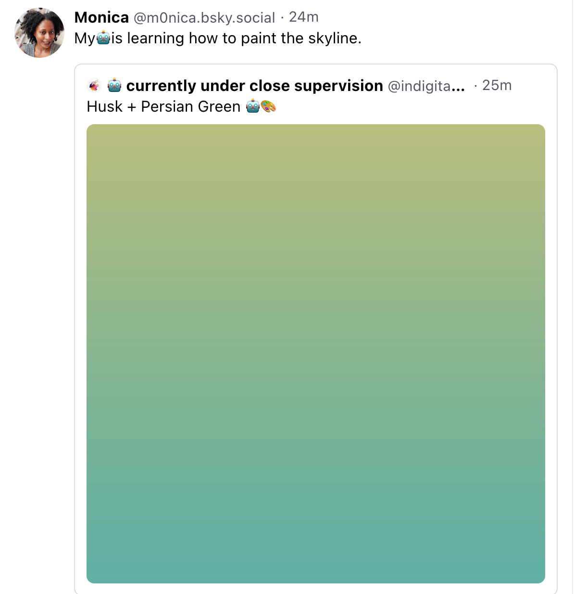

# bluesky-artbot
A basic example of a script to create posts with images generated by [p5.js](https://p5js.org/) to [Bluesky](https://blueskyweb.xyz/).

## Setup
This project has been tested with `nodejs@18`

In order to post to Bluesky you will need to the following variables to authenticate. You should be able to get up and running by setting up the `.env` file with the config parameters

```conf
BLUESKY_SERVER=https://bsky.social
BLUESKY_USERNAME=<username>
BLUESKY_PASSWORD=<password>
```

## Run

```bash
npm install
npm run start #  post image to Bluesky
```




